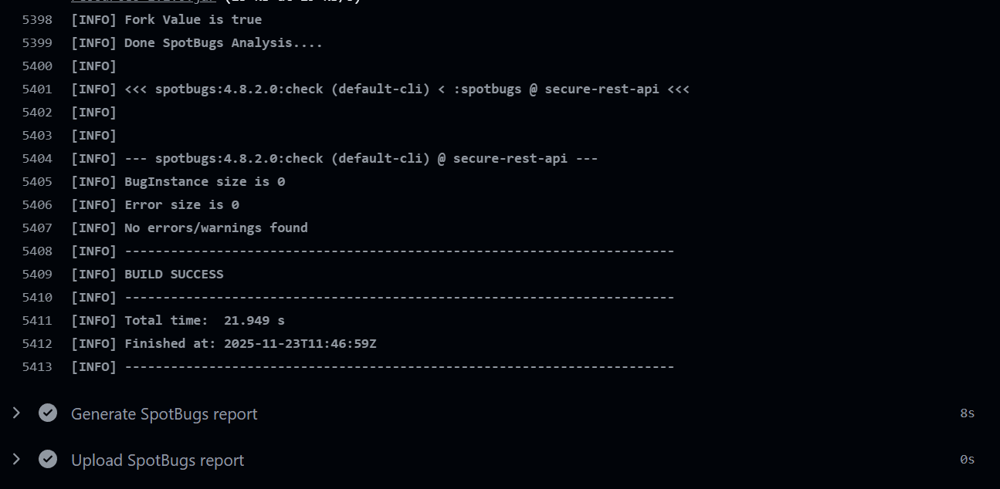
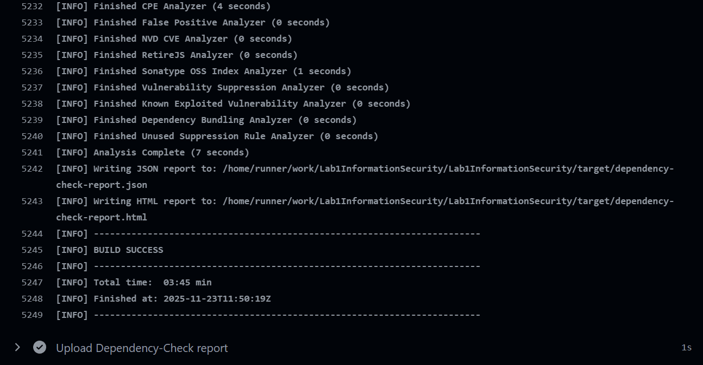
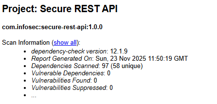

# Работа 1: Разработка защищенного REST API с интеграцией в CI/CD
## Описание

Учебное backend‑приложение на **Java** с использованием фреймворка **Spring Boot**. Приложение позволяет регистрироваться и аутентифицироваться пользователю, а также записывать данные типа Заголовок/Тело в общий список, с возможностью дальнейшего просмотра. Приложение обеспечивает:

- Аутентификацию с использованием JWT токенов
- Защиту от XSS атак, SQL инъекций
- Автоматизированные проверки безопасности в CI/CD через SpotBugs и OWASP Dependency‑Check

## API

Всего на сервере 3 эндпоинта:

1. **POST /auth/login** - аутентификация пользователя. Если пользователя не существует, будет создан новый
2. **GET /api/data** - получение общего списка объектов типа Заголовок/Тело. Также возвращается имя автора и дата создания
3. **POST /api/data** - публикация нового элемента списка

## Описание реализованных мер защиты

### SQL Injection

В проекте использованы Spring Data/Hibernate, использующие параметризованные запросы, защищающие от инъекций

### XSS

- При возврате данных введенных пользователем используется `DataService.escapeHtml()`, реализованный с OWASP Java Encoder
- Данные из запроса валидируются аннотациями Spring, такие как `@Valid`, `@NotBlank`
- Также настроены заголовки **Content Security Policy (CSP)**, **X-XSS-Protection**

### Аутентификация и защита паролей

- При аутентификации пользователю выдаются JWT токены
- JWT-токен проверяется на всех защищенных эндпоинтах при помощи `JwtAuthenticationFilter`
- Пароли никогда не сохраняются в чистом виде. Вместо этого они хэшируются с помощью **BCrypt**

## Скриншоты отчетов SAST/SCA

1. Для SAST использовался spotbugs

2. Для SCA использовался OWASP Dependency-Check

